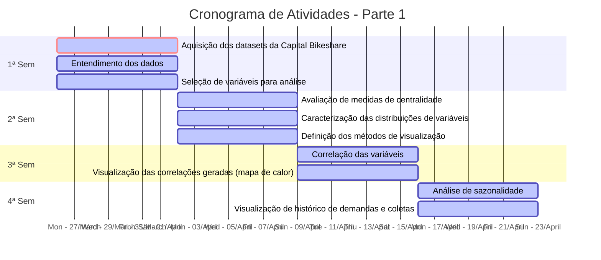
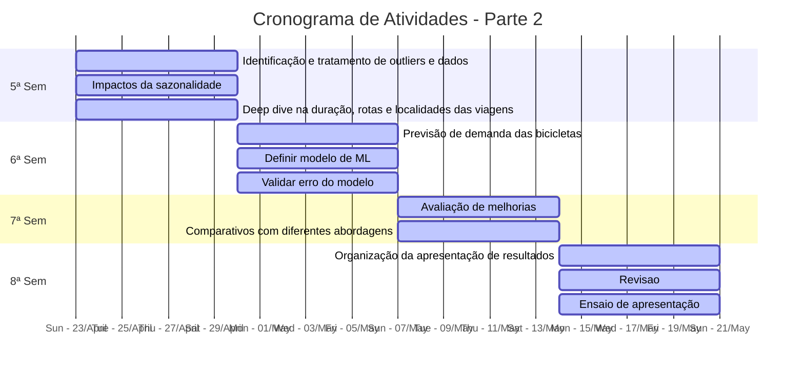

# Oferta e Demanda de aluguel de bicicletas da Capital Bikeshare 
Este repositório é destinado ao desenvolvimento do trabalho proposto durante a disciplina "Projeto Aplicado I" do curso de Ciência de Dados da Universidade Presbiteriana Mackenzie.

## Integrantes
- [Daniel Rodrigues da Silva](https://www.linkedin.com/in/danielrod147/)
- [Dianna Mayumi Santos Katayama Rodrigues](https://www.linkedin.com/in/dianna-katayama-016274216/)
- [inserir nomes]

## Objetivo
Desenvolvimento de um estudo prático sobre dados de utilização de serviços da empresa [Capital Bikeshare](https://capitalbikeshare.com), apresentando dois produtos, a saber: 
- Análise exploratória de dados; 
- Recomendação de locais para amplicação das estações de bicicletas, ou, maior frequência de redistribuição de bicicletas com base na demanda histórica de cada localidade.

### Sobre a Capital Bikeshare
A Capital Bikeshare é uma empresa de responsabilidade da Autoridade de Trânsito da Área Metropolitana de Washington (Metro DC) que visa facilitar a mobilidade de pessoas fornecendo bicicletas para locomoção por meio de planos e pacotes de serviços, visando menor utilização de veículos emissores de gases do efeito estufa, reduzindo a poluição e intensidade do trâncito.

## Base de dados
A base de dados utilizada está disponível em [Trip History Data](https://s3.amazonaws.com/capitalbikeshare-data/index.html), contendo dados sobre a utilização de bicicletas, desde tempo de viagem até destino final e tipo de consumidores.

Para fins didáticos, apenas o histórico de dados de Setembro/2022 a Fevereiro/2023 serão utilizados.

### Descrição das colunas contidas na base:

- **Duration** – Duração da viagem
- **Start Date** – Data e hora do início da viagem
- **End Date** – Data e hora do fim da viagem
- **Start Station** – Nome da estação de início da viagem
- **End Station** – Nome da estação de fim da viagem
- **Bike Number** – ID único da bicicleta utilizada na viagem
- **Member Type** – Indica se o utilizador é um membro registrado ('registered' - Membro anual, mensal ou de dias fixos), casual ('casual' - viagem única, passe de 5, 3 ou 1 dia)

### Termos de uso
A empresa responsável pelos dados garante total liberdade para utilização, modificação e compartilhamento dos dados, desde que o objetivo do uso não envolva atividades ilegais ou venda dos dados disponibilizados gratuitamente.

Para mais detalhes, acessar os [Termos de Uso](https://ride.capitalbikeshare.com/data-license-agreement) na íntegra.

## Cronograma

